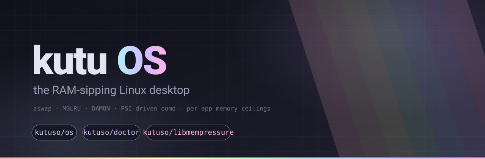

  

**kutu OS** is a Linux desktop that treats memory as the scarce resource it
now is. Between 2025 and 2026 DRAM prices roughly quintupled; kutu applies
the memory-conservation stack Google and Meta proved at fleet scale —
zstd-compressed zswap, MGLRU page aging, DAMON proactive reclaim and
PSI-driven systemd-oomd — to an ordinary Arch-based XFCE desktop, with safe
defaults, per-application memory ceilings, and nothing to configure.

## The repos

| Repository | What it is |
|---|---|
| [kutuso/os](https://github.com/kutuso/os) | **The distro** — archiso profile, packages, offline Calamares installer, QEMU-gated CI, [documentation](https://kutu.so) |
| [kutuso/doctor](https://github.com/kutuso/doctor) | **kutu-doctor** — live memory-health dashboard, stack verifier and mode switcher (Python; runs on any distro) |
| [kutuso/libmempressure](https://github.com/kutuso/libmempressure) | **libmempressure** — memory-pressure events from kernel PSI for C, C++, JVM and Python; an `onTrimMemory()` for Linux (RPM + DEB packaging included) |

  
  

the live desktop and the offline installer — real screenshots, captured from the same ISO CI smoke-tests on every release

## Get it

- **Downloads**: [releases](https://github.com/kutuso/os/releases) — boot the live USB, click install
- **Website & docs**: [kutu.so](https://kutu.so)
- **Design spec**: [ramageddon-pivot-design](https://github.com/kutuso/os/blob/master/superpowers/specs/2026-08-27-ramageddon-pivot-design.md)
- **Changelog**: [CHANGELOG.md](https://github.com/kutuso/os/blob/master/CHANGELOG.md)

MIT &amp; CC-BY-SA.
